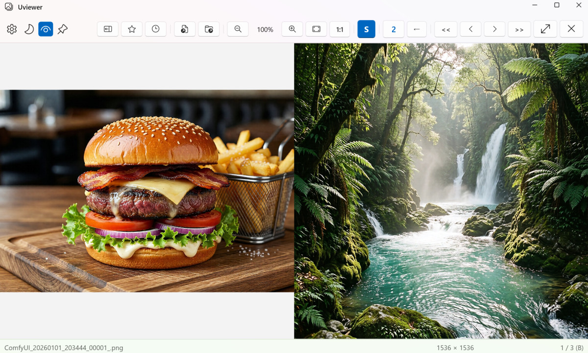

# Uviewer

> Created with Vibe Coding 🚀



**Uviewer** is a versatile, integrated viewer for Windows, designed to handle Images, Text, and EPUB documents seamlessy. Built with **WinUI 3** and **.NET 10**, it offers a modern, high-performance experience with advanced features like Aozora Bunko, Markdown support and smart encoding detection.

## ✨ Key Features

### 🖼️ Image Viewing
- **Broad Format Support**: JPEG, PNG, GIF, BMP, TIFF, ICO, SVG, WebP, AVIF (AV1 Video Extension required), JXL (JPEG XL Image Extension required) and **Animated WebP**.
- **High-Performance Rendering**: Powered by **Win2D** (Direct2D) for smooth zooming and panning.
- **Smart Scaling**: Customizable zoom levels (0.1x to 10x), fit-to-window, and actual size.
- **Tools**: Sharpening filter, Side-by-Side view mode, **Match Control Direction** (R-to-L navigation support), and Fast Navigation overlay.

### 📝 Text & Novel Viewing
- **Advanced Text Engine**: 
  - **Immediate loading of large text files**
  - **Aozora Bunko format Support**: Native rendering of Ruby text (Furigana), emphasis, indentation and images.
  - **Markdown Support**: Custom-built Markdown rendering including tables, code blocks, and inline formatting.
  - **Smart Encoding Detection**: Automatically detects and handles various encodings (UTF-8, Unicode, **EUC-KR**, **Shift-JIS**, **Johab**).
- **Reading Comfort**: 
  - **Adjustable Styling**: Change font size, font family (Yu Gothic Medium/Yu Mincho/Custom), and background themes (Light/Beige/Dark). (Recommendation: We suggest installing and using [**Noto Sans/Serif CJK**](https://fonts.google.com/noto) for the best multilingual reading experience.)
  - **Vertical Mode (Tategaki)**: Comprehensive support for vertical text rendering with pixel-accurate layout.
- **Go to Line**: Jump directly to a specific line (G).
- **Table of Contents (TOC)**: Automatically extracts headings (Markdown `#` or Aozora `［＃...］` tags) for quick navigation.
- **Line Bookmark**: Save your reading progress (Line number) to Favorites and resume exactly where you left off.

### 📖 EPUB Reader
- **Full EPUB Support**: Page-based navigation with chapter tracking.
- **Table of Contents**: Support for Navigation via TOC.
- **Customization**: Adjustable font settings (font family/size) and background colors.
- **Vertical Support**: View EPUBs in vertical mode

### 📂 File Management
- **Integrated Explorer**: Sidebar with Folder/Thumbnail views for easy navigation.
- **Archive Support**: Read images directly from compressed archives (`.zip`, `.rar`, `.7z`, etc.) using **SharpCompress**.
- **Organization**: "Favorites" and "Recent Files" management.
- **WebDAV Support**: Read images directly from WebDAV(HTTPS) servers.

### 🔧 Settings

#### ⚙️ Multiple Instances
- **Allow Multiple Instances**: When enabled, each file opens in a new window instance. When disabled, files open in the already running instance using inter-process communication (NamedPipe).
  - Default: **Enabled** (`true`)
  - Toggle via Settings menu
  - Setting persists across sessions

### 🌍 Localization
- **Multi-language Support**: Automatically detects and switches between **English**, **Korean**, and **Japanese** based on system settings.

### 🎨 Global Theme & Design
- **Dark & Light Mode**: Seamlessly switch between dark and light themes for the entire interface.
- **Modern Windows Integration**: Features an extended title bar with modern styling, similar to Windows 11 system apps like Explorer and Settings.
- **Unified Aesthetics**: All UI components, including the custom title bar and status bar, dynamically sync with the selected system theme.

## 🛠️ System Requirements
- **OS**: Windows 10 (Version 19041+) or Windows 11.
- **Runtime**: .NET 10.0.
- **Framework**: Windows App SDK 1.8+.

## ⌨️ Keyboard Shortcuts

| Key | Context | Action |
|-----|---------|--------|
| **← / →** | Image | Previous / Next Image |
| | Text | Previous / Next Page |
| **↑ / ↓** | Global | Previous / Next File |
| **Home / End** | Image / Archive | First / Last Image |
| | Text | First / Last Page |
| | EPUB | Previous / Next Chapter |
| **Space** | Image | Toggle 2-Page View (Side-by-Side) |
| **V** | Text / EPUB | Toggle Vertical Mode (Tategaki) |
| **Backspace** | Global | Go to Parent Folder |
| **Esc** | Global | Close Window / Exit Fullscreen |
| **F11** | Global | Toggle Fullscreen |
| **Ctrl + O** | Global | Open File |
| **Ctrl + B** | Global | Toggle Sidebar |
| **Ctrl + F** | Global | Toggle Favorites |
| **Ctrl + S** | Global | Add to Favorites |
| **G** | Text/EPUB | Go to Line |
| **+ / -** | Global | Zoom In/Out / Font Size Up/Down |
| **0** | Image | Reset Zoom to 100% |
| **S** | Image | Toggle Sharpening |
| **A** | Text | Toggle Simple text / Advanved rendering (Aozora, Markdown) mode |
| **B** | Text | Change Background Theme |
| **F** | Text | Change Font |

## Mouse & Touch Navigation
- **Click/Touch Left Side**: Previous Page / Image
- **Click/Touch Right Side**: Next Page / Image
- **Control Direction Match**: When enabled in Side-by-Side mode (←), controls automatically invert to match the visual page progression.

## 🚀 Installation

### 📥 Download
You can download the latest version from the [Releases Page](https://github.com/kirinonakar/Uviewer/releases).
Unzip the file and run `Uviewer.exe`.


### From Source
1. Clone the repository:
   ```bash
   git clone https://github.com/kirinonakar/Uviewer.git
   cd Uviewer
   ```
2. Open `Uviewer.sln` in **Visual Studio 2022**.
   - Required workloads: **.NET Desktop Development**.
   - Required extension: **Windows App SDK**.
3. Build and Run:
   - Select `x64` or `arm64`.
   - Press **F5**.

### Build via Command Line
```bash
dotnet build Uviewer.sln -c Release
```

## 🏗️ Architecture
- **WinUI 3**: Modern UI framework.
- **Win2D**: Hardware-accelerated 2D graphics for images.
- **ImageSharp**: Cross-platform image processing.
- **SharpCompress**: Archive extraction.

## 📝 License
This project is licensed under the MIT License. See the [LICENSE](LICENSE) file for details.

## 👤 Author
**kirinonakar** - [kirinonakar](https://github.com/kirinonakar)
