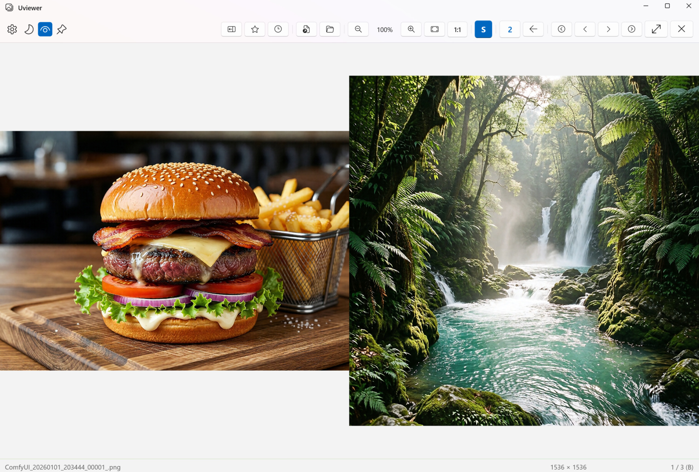

# Uviewer

> Created with Vibe Coding 🚀



**Uviewer** is a versatile, integrated viewer for Windows that delivers a modern, high-performance experience built on **WinUI 3** and **.NET 10**. It seamlessly handles images, text, PDF and EPUB documents, offering advanced capabilities such as direct image viewing from **archives**, **side-by-side viewing modes**, and robust support for **Aozora Bunko**—complete with **vertical text rendering**. Designed for flexibility, it also features integrated **Markdown support**, smart encoding detection, and **WebDAV connectivity** to streamline your digital reading and viewing workflow.

## ✨ Key Features

### 🖼️ Image & PDF Viewing
- **Broad Format Support**: PDF, JPEG, PNG, GIF, BMP, TIFF, ICO, SVG, WebP, AVIF (AV1 Video Extension required), JXL (JPEG XL Image Extension required) and **Animated WebP**.
- **High-Performance Rendering**: Powered by **Win2D** (Direct2D) for smooth zooming and panning.
- **Smart Scaling**: Customizable zoom levels (0.1x to 10x), fit-to-window, and actual size.
- **Tools**: Sharpening filter, Side-by-Side view mode, **Match Control Direction** (R-to-L navigation support), and Fast Navigation overlay.

### 📝 Text & Novel Viewing
- **Advanced Text Engine**: 
  - **Immediate loading of large text files**
  - **Aozora Bunko format Support**: Native rendering of Ruby text (Furigana), emphasis, indentation and images.
  - **Markdown Support**: Custom-built Markdown rendering including tables, code blocks, and inline formatting.
  - **Smart Encoding Detection**: Automatically detects and handles various encodings (UTF-8, Unicode, **EUC-KR**, **Shift-JIS**, **Johab**).
- **Reading Comfort**: 
  - **Adjustable Styling**: Change font size, font family (Yu Gothic Medium/Yu Mincho/Custom), and background themes (Light/Beige/Dark). (Recommendation: We suggest installing and using [**Noto Sans/Serif CJK**](https://fonts.google.com/noto) for the best multilingual reading experience.)
  - **Vertical Mode (Tategaki)**: Comprehensive support for vertical text rendering with pixel-accurate layout.
- **Go to Line**: Jump directly to a specific line (G).
- **Table of Contents (TOC)**: Automatically extracts headings from textual documents (Markdown `#` or Aozora `［＃...］` tags) and **PDF Bookmarks** for quick navigation.
- **Line Bookmark**: Save your reading progress (Line number) to Favorites and resume exactly where you left off.

### 📖 EPUB Reader
- **Full EPUB Support**: Page-based navigation with chapter tracking.
- **Table of Contents**: Support for Navigation via TOC.
- **Customization**: Adjustable font settings (font family/size) and background colors.
- **Vertical Support**: View EPUBs in vertical mode

### 📂 File Management
- **Integrated Explorer**: Sidebar with Folder/Thumbnail views for easy navigation.
- **Archive Support**: Read images directly from compressed archives (`.zip`, `.rar`, `.7z`, etc.) using **SharpCompress** and **SevenZipExtractor**.
- **Organization**: "Favorites" and "Recent Files" management.
- **WebDAV Support**: Read images directly from WebDAV (HTTPS) servers.

### 🔧 Settings

#### 📌 Pin / Auto-Hide UI
- **Pin Toggle**: Pin or unpin the UI (title bar, toolbar, sidebar, status bar) using the pin button or the **`** (backtick) key.
  - **Pinned** (default): All UI elements are always visible.
  - **Unpinned**: All UI elements are hidden. Hover over the top edge to reveal the title bar, toolbar and status bar, or hover over the left edge to reveal the sidebar. UI auto-hides after 1 second when the mouse leaves.
  - Setting persists across sessions.

#### ⚙️ Multiple Instances
- **Allow Multiple Instances**: When enabled, each file opens in a new window instance. When disabled, files open in the already running instance using inter-process communication (NamedPipe).
  - Default: **Enabled** (`true`)
  - Toggle via Settings menu
  - Setting persists across sessions

### 🌍 Localization
- **Multi-language Support**: Automatically detects and switches between **English**, **Korean**, and **Japanese** based on system settings.

### 🎨 Global Theme & Design
- **Dark & Light Mode**: Seamlessly switch between dark and light themes for the entire interface.
- **Modern Windows Integration**: Features an extended title bar with modern styling, similar to Windows 11 system apps like Explorer and Settings.
- **Unified Aesthetics**: All UI components, including the custom title bar and status bar, dynamically sync with the selected system theme.

## 🛠️ System Requirements
- **OS**: Windows 10 (Version 19041+) or Windows 11.
- **Runtime**: .NET 10.0.
- **Framework**: Windows App SDK 1.8+.

## ⌨️ Keyboard Shortcuts

| Key | Context | Action |
|-----|---------|--------|
| **← / →** | Image | Previous / Next Image |
| | Text | Previous / Next Page |
| **↑ / ↓** | Global | Previous / Next File |
| **Home / End** | Image / Archive | First / Last Image |
| | Text / PDF | First / Last Page |
| | EPUB | Previous / Next Chapter |
| **Space** | Image | Toggle 2-Page View (Side-by-Side) |
| **V** | Text / EPUB | Toggle Vertical Mode (Tategaki) |
| **Backspace** | Global | Go to Parent Folder |
| **Esc** | Global | Close Window / Exit Fullscreen |
| **F11** | Global | Toggle Fullscreen |
| **`** | Global | Toggle Pin (Auto-Hide UI) |
| **T** | Global | Toggle Always on Top |
| **Ctrl + O** | Global | Open File |
| **Ctrl + B** | Global | Toggle Sidebar |
| **Ctrl + F** | Global | Toggle Favorites |
| **Ctrl + S** | Global | Add to Favorites |
| **G** | Text/EPUB | Go to Line |
| | PDF | Go to Page |
| **+ / -**  | Global | Zoom In/Out / Font Size Up/Down (-/= also works) |
| **0** | Image | Reset Zoom to 100% |
| **S** | Image | Toggle Sharpening |
| **A** | Text | Toggle Simple text / Advanved rendering (Aozora, Markdown) mode |
| **B** | Text | Change Background Theme |
| **F** | Text | Change Font |

## Mouse & Touch Navigation
- **Click/Touch Left Side**: Previous Page / Image
- **Click/Touch Right Side**: Next Page / Image
- **Pinch Zoom (PDF)**: Support for pinch-to-zoom gestures on touchpads and touchscreens.
- **Control Direction Match**: When enabled in Side-by-Side mode (←), controls automatically invert to match the visual page progression.

## 🚀 Installation

### 📥 Download
You can download the latest version from the [Releases Page](https://github.com/kirinonakar/Uviewer/releases).
Unzip the file and run `Uviewer.exe`.

- [Microsoft Store](https://apps.microsoft.com/detail/9N6DL9Q4S6FK?hl=ko-kr&gl=KR&ocid=pdpshare)


### From Source
1. Clone the repository:
   ```bash
   git clone https://github.com/kirinonakar/Uviewer.git
   cd Uviewer
   ```
2. Open `Uviewer.sln` in **Visual Studio 2022**.
   - Required workloads: **.NET Desktop Development**.
   - Required extension: **Windows App SDK**.
3. Build and Run:
   - Select `x64` or `arm64`.
   - Press **F5**.

### Build via Command Line
```bash
dotnet build Uviewer.sln -c Release
```

## 🏗️ Architecture
- **WinUI 3**: Modern UI framework.
- **Win2D**: Hardware-accelerated 2D graphics for images.
- **Windows.Data.Pdf**: Integrated OS-level PDF rendering.
- **PdfPig**: Used for parsing PDF tables of contents.
- **SharpCompress**: Archive extraction for ZIP, RAR, etc.
- **SevenZipExtractor**: High-performance extraction for `.7z` archives using native **7z.dll** (located in the `Libs` directory).

## 📝 License
This project is licensed under the MIT License. See the [LICENSE](LICENSE) file for details.

### Third-Party Licenses
- **7-Zip (7z.dll)**: Licensed under the **GNU LGPL**. For more information, please visit [www.7-zip.org](https://www.7-zip.org).

## 👤 Author
**kirinonakar** - [kirinonakar](https://github.com/kirinonakar)
